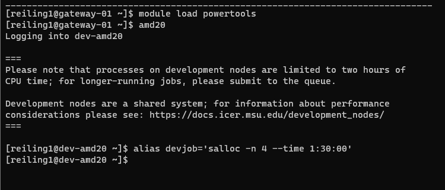
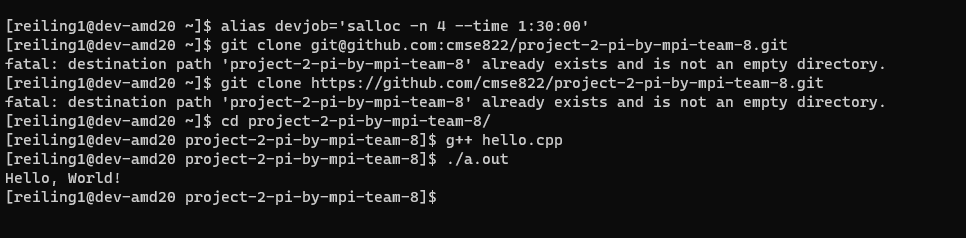
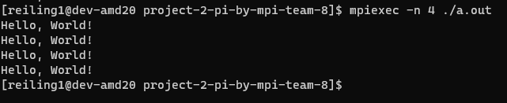
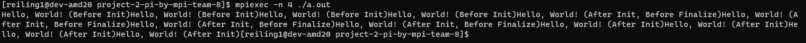

# Project 2: Getting Started with MPI

## Due: EOD, 9 February

## Learning goals

Disclosure, this assignment was assisted with the use of ChatGPT

In this project you will explore using basic MPI collectives on HPCC. After finishing this project, you should

- understand how to parallelize a simple serial code with MPI,
- understand how to use basic MPI collectives,
- be able to run MPI-parallel applications on HPCC,
- develop your theoretical understanding of key parallel computing concepts such as:
  - functional parallelism,
  - collective communication,
  - parallel scaling, and
  - parallel efficiency.

## Part 1: Warm-up Exercises

As a group, complete the following exercises from [HPSC](../assets/EijkhoutIntroToHPC2020.pdf).

| Exercise Num  | Reference Page     | Problem Answers  |
| :------------:|:-------------------| :---------------:|
| Exercise 2.18 | Reference page 103 | There are many types of race conditions that could happen in the parallel for loop. Since a[i] will be accessed by multiple threads, this value will be overwritten. Depending on which processor is running the for loop, elements would be overwritten and be stored in different caches depending on the memory location. Additionally, the a[i] needs to be global but writing back to memory can only be done with one tread at a time to prevent race conditions. |
| Exercise 2.19 | Reference page 106 | Programming the for loop in this way is not good for performance because multiple threads are sharing the same cache line. Even though there are two threads computing this problem, the processor may need to synchronize more often then necessary when one thread updates its variable. When this happens, the entire cache line is marked invalid even though the other variables are not related to the update. Since there is increased communication between threads and processors, there is decreased performance. A good chunksize would be one where the treads can work in their own cache lines without interfereing with each other. |
| Exercise 2.21 | Reference page 112 | Not Complete #Cheng |
| Exercise 2.22 | Reference page 115 | Not Complete #Cheng |
| Exercise 2.23 | Reference page 117 | Not Complete #Jacob |
| Exercise 2.27 | Reference page 130 | Not Complete #Jacob |

Include your responses to these exercises in your project write-up.

## Part 2: Setup on HPCC

The following is a very quick tutorial on the basics of using HPCC for this class.

1. Log in to the HPCC gateway:

    ```shell
    ssh <netid>@hpcc.msu.edu
    ```

2. Then log in to the AMD-20 cluster from the gateway:

    ```shell
    module load powertools
    amd20
    ```

3. The default environment and software stack should be sufficient for this exercise, but if you run into issues compiling and running the code try issuing the following commands.

    ```shell
    module purge
    module load intel/2021a
    ```

4. When using the HPCC for development and exercises in this class please do NOT just use the head node, `dev-amd20`. We will swamp the node and no one will get anything done. Instead, request an interactive job using the SLURM scheduler. An easy way to do this is to set up an alias command like so:

    ```shell
    alias devjob='salloc -n 4 --time 1:30:00'
    ```

5. Run `devjob`, then to request 4 tasks for 90 minutes. This should be sufficient for most of the stuff we do during class, though for your projects you will at times require more resources. The above `module` and `alias` commands can be added to your `.bashrc` so that they are automatically executed when you log in.
    


## Part 3: MPI Basics  (TODO: Jacob, write up/screenshots)

1. Clone your Project 2 repo from GitHub on HPCC. Done!

2. In the project directory you will find a simple "Hello World!" source file in C++. Compile and run the code. E.g.,

    ```shell
    g++ hello.cpp
    ./a.out
    ```

    

3. Now run the executable `a.out` using the MPI parallel run command and explain the output:

    ```shell
    mpiexec -n 4 ./a.out 
    ```
    

    When implementing part 2, HPCC prints out "Hello, World!" once. For part 3 and typing "mpiexec -n 4 ./a.out" prints "Hello, World!" four times.

4. Add the commands `MPI_Init` and `MPI_Finalize` to your code. Put three different print statements in your code: one before the init, one between init and finalize, and one after the finalize. Recompile and run the executable, both in serial and with `mpiexec`, and explain the output.

    
    There are four print statements before the MPI initialize, four print statments after initialize and before finalize, four print statemtns after finalize. (Not correct, look at book problems 2.3-2.5)

5. Complete Exercises 2.3, 2.4, and 2.5 in the [Parallel Programing](../assets/EijkhoutParallelProgramming.pdf) book. 
   Exercise 2.3: First, given that an addition and moving a number from one processor to another both take a unit time. In each step, we are (1) adding two numbers and (2) moving a number to another processor. So the communication time equals the computation time.
   Second, if sending a number from processor p to p+-k takes time k, the communication time increase linearly with distance k, but the number of steps to complete the reduction is log in the size of n, since the number of numbers reduce by half in each step. So the execution time of the parallel algorithm is of the same order as the sequential time.
   Exercise 2.4: 
   The case of summing 8 elements with 4 processors.
   Initial Condition: Each processor has two elements.
   Step 1: Each processor sums its two elements. (no communication)
   Step 2: Two processors sum the numbers. (2 communication)
   Step 3: One processor sums the two result in Step 2. (1 communication)
   Comparing to Figure 2.3 of the textbook, this is the same as saying the edges connected to the top layer of the graph does not correspond to actual communications.
   The case of summing 16 elements with 4 processors.
   Initial Condition: Each processor has four elements.
   Step 1: Each processor sums two pair of elements into two numbers. (no communication)
   Step 2: Fixing one of the two numbers in each processor, two processors sum the numbers. (2 communication)
   Step 3: One processor sums the two result in Step 2. (1 communication)
   Step 4: Repeat Step 2 ~ 3 for the other number in each processor.
   Step 5: Sum the two numbers. (no communication)
   The number of communication edges is 6.
   Exercise 2.5:
   1. No, since x[i,j] depends on x[i,j-1].
   2. No, since x[i,j] depends on x[i-1,j].
   3. x[2,1] = x[1,1] + x[2,0], where x[1,1] is known and x[2,0] is also known from the first loop.
      Similarly, x[1,2] = x[0,2] + x[1,1], where x[2,0] is known from the first loop and x[1,1] is also known.
      Therefore, if x[1,1] is known, then both x[2,1] and x[1,2] can be computed independently.
   4. Starting with x[1,1] known, we can compte x[2,1] and x[1,2] independently. The underlying background may be that all x[i,j] with i + j = some   constant do not depend on each other. In this case, a strategy will be to initialize by computing x[1,1] after the first loop, and parallelly compute all elements x[i,j], i + j = 3, and then move on to all elements x[i,j], i + j = 4, and so on.

## Part 4: Eat Some Pi  (TODO: Berk, write up/screenshots)

Pi is the ratio of a circle's circumference to its diameter. As such, the value of pi can be computed as follows. Consider a circle of radius `r` inscribed in a square of side length `r`. Randomly generate points within the square. Determine the number of points in the square that are also in the circle. If `f=nc/ns` is the number of points in the circle divided by the number of points in the square then `pi` can be approximated as `pi ~ 4f`. Note that the more points generated, the better the approximation.

1. Look at the C program `ser_pi_calc`. Extend this program using collective MPI routines to compute `pi` in parallel using the method described above. Feel free to use C++, if you prefer, of course.

2. For the first iteration, perform the same number of "rounds" on each MPI rank. Measure the total runtime using `MPI_WTIME()`. Vary the number of ranks used from 1 to 4. How does the total runtime change?

3. Now, divide the number of "rounds" up amongst the number of ranks using the appropriate MPI routines to decide how to distribute the work. Again, run the program on 1 to 4 ranks. How does the runtime vary now?

4. Now let's change the number of "darts" and ranks. Use your MPI program to compute `pi` using total numbers of "darts" of 1E3, 1E6, and 1E9\. For each dart count, run your code on HPCC with processor counts of 1, 2, 4, 8, 16, 32, and 64\. Keep track of the resulting value of `pi` and the runtimes. Use non-interactive jobs and modify the `submitjob.sb` script as necessary.

5. For each processor count, plot the resulting errors in your computed values of `pi` compared to the true value as functions of the number of darts used to compute it. Use log-log scaling on this plot. What is the rate of convergence of your algorithm for computing `pi`? Does this value make sense? Does the error or rate of convergence to the correct answer vary with processor count? Should it?

6. For each dart count, make a plot of runtime versus processor count. Each line represents a "strong scaling" study for your code. For each dart count, also plot the "ideal" scaling line. Calculate the parallel scaling efficiency of your code for each dart count. Does the parallel performance vary with dart count? Explain your answer.

7. Going further. Try running your code on different node types on HPCC with varied core counts. In particular, try to ensure that your runs utilize multiple nodes so that the communication network is used. Do you see a change in the communication cost when the job is run on more than one node?

## What to turn-in

To your git project repo, commit your final working code for the above exercises and a concise write-up including responses to the warm-up exercises, performance and accuracy data for your calculations of `pi`, the plots made in Part 4, and detailed responses to the questions posed concerning your results.
