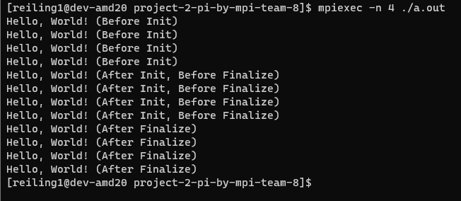

# Project 2: Getting Started with MPI

## Due: EOD, 15 February

## Learning goals

Disclosure, this assignment was assisted with the use of ChatGPT

In this project you will explore using basic MPI collectives on HPCC. After finishing this project, you should

- understand how to parallelize a simple serial code with MPI,
- understand how to use basic MPI collectives,
- be able to run MPI-parallel applications on HPCC,
- develop your theoretical understanding of key parallel computing concepts such as:
  - functional parallelism,
  - collective communication,
  - parallel scaling, and
  - parallel efficiency.

## Part 1: Warm-up Exercises

As a group, complete the following exercises from [HPSC](../assets/EijkhoutIntroToHPC2020.pdf).

| Exercise Num  | Reference Page     | Problem Answers  |
| :------------:|:-------------------| :---------------:|
| Exercise 2.18 | Reference page 103 | There are many types of race conditions that could happen in the parallel for loop. Since a[i] will be accessed by multiple threads, this value will be overwritten. Depending on which processor is running the for loop, elements would be overwritten and be stored in different caches depending on the memory location. Additionally, the a[i] needs to be global but writing back to memory can only be done with one tread at a time to prevent race conditions. |
| Exercise 2.19 | Reference page 106 | Programming the for loop in this way is not good for performance because multiple threads are sharing the same cache line. Even though there are two threads computing this problem, the processor may need to synchronize more often then necessary when one thread updates its variable. When this happens, the entire cache line is marked invalid even though the other variables are not related to the update. Since there is increased communication between threads and processors, there is decreased performance. A good chunksize would be one where the treads can work in their own cache lines without interfereing with each other. |
| Exercise 2.21 | Reference page 112 |  While we need to implement the boundary condition, the provided code has already perform the necessary exceptions for the first and last processors by setting b[-1] and b[LocalProblemSize] to MPI_PROC_NUll. We will be replacing 'a[i] = (b[i]+bleft+bright)/3' in line 13 of page 112 by a if-else statement 'if (i == 0) {a[i] = (b[i]+bright)/2} else if (i==LocalProblemSize-1) {a[i] = (b[i]+bleft)/2} else {a[i] = (b[i]+bleft+bright)/3}', also correspondinly abandon 'if (i==0) bleft=bfromleft;' and 'if (i==LocalProblemSize-1) bright=bfromright;' since with MPI_PROC_NUll bleft and bright are not receiving any information at boundary. |
| Exercise 2.22 | Reference page 115 | Not Complete #Cheng |
| Exercise 2.23 | Reference page 117 | When we analyze the discussion of the last item above this exercise, we find that the hybrid approach bundles messages, with an example given of two processes on one node sending messages to two processes on another node, creating four messages in total that need to be sent that the hybrid approach would bundle into one message. This means that the hybrid model would have a huge advantage over the purely distributed model in the scenario given in this exercise, as the bandwidth between the two nodes is only enough to sustain one message at a time. This means that, in terms of the scenario mentioned right before this exercise, the bandwidth of the hybrid model and the purely distributed model would be the same, but the hybrid model's latency would be 1/4th that of the purely distributed model since the hybrid model can send four full four-process messages back and forth in the time it takes the purely distributed model to send one full four-process message back and forth. This is because the hybrid model is sending one full four-process message between the nodes every time, but the purely distributed model can only send 1/4th of a full four-process message between the nodes every time due to the bandwidth restrictions. |
| Exercise 2.27 | Reference page 130 | First we should consider the border cases of this question, such as how much we gain from overlapping communication with computation when there is no computation performance cost and vice versa. If there is no communication latency or no computation performance cost, then we gain nothing from overlapping them because the performance of the overall process would be the same regardless of if you overlapped them. So, understanding that our minimum performance gains come from these border cases, we can see that the general case where there is at least some performance cost for computation and some latency for communication leads to some gains when we overlap the computation and communication of our processes. This means that our maximum gains would come from when our computation performance cost and our communication latency are hypothetically equal, which cuts the time the process takes in half as it means that we can overlap the computation and communication of processes perfectly so that a process that's finished computing isn't waiting on communicating or vice versa. |

Include your responses to these exercises in your project write-up.

## Part 2: Setup on HPCC

The following is a very quick tutorial on the basics of using HPCC for this class.

1. Log in to the HPCC gateway:

    ```shell
    ssh <netid>@hpcc.msu.edu
    ```

2. Then log in to the AMD-20 cluster from the gateway:

    ```shell
    module load powertools
    amd20
    ```

3. The default environment and software stack should be sufficient for this exercise, but if you run into issues compiling and running the code try issuing the following commands.

    ```shell
    module purge
    module load intel/2021a
    ```

4. When using the HPCC for development and exercises in this class please do NOT just use the head node, `dev-amd20`. We will swamp the node and no one will get anything done. Instead, request an interactive job using the SLURM scheduler. An easy way to do this is to set up an alias command like so:

    ```shell
    alias devjob='salloc -n 4 --time 1:30:00'
    ```

5. Run `devjob`, then to request 4 tasks for 90 minutes. This should be sufficient for most of the stuff we do during class, though for your projects you will at times require more resources. The above `module` and `alias` commands can be added to your `.bashrc` so that they are automatically executed when you log in.
    

## Part 3: MPI Basics

1. Clone your Project 2 repo from GitHub on HPCC. Done!

2. In the project directory you will find a simple "Hello World!" source file in C++. Compile and run the code. E.g.,

    ```shell
    g++ hello.cpp
    ./a.out
    ```

    

3. Now run the executable `a.out` using the MPI parallel run command and explain the output:

    ```shell
    mpiexec -n 4 ./a.out 
    ```

    

    When implementing part 2, HPCC prints out "Hello, World!" once. For part 3 and typing "mpiexec -n 4 ./a.out" prints "Hello, World!" four times.

4. Add the commands `MPI_Init` and `MPI_Finalize` to your code. Put three different print statements in your code: one before the init, one between init and finalize, and one after the finalize. Recompile and run the executable, both in serial and with `mpiexec`, and explain the output.

    
    There are four print statements before the MPI initialize, four print statments after initialize and before finalize, four print statemtns after finalize. (Not correct, look at book problems 2.3-2.5)

5. Complete Exercises 2.3, 2.4, and 2.5 in the [Parallel Programing](../assets/EijkhoutParallelProgramming.pdf) book. <br>

    For all exercises, please reference helloCversion.c. <br>

    Exercise 2.3: <br>
    

    Exercise 2.4: <br>
     <br>
    
    Please see files "file_1.txt" and "file_0.txt" for the written responses for second version of this program.

    Exercise 2.5: <br>
    

## Part 4: Eat Some Pi  (TODO: Berk, write up/screenshots)

Pi is the ratio of a circle's circumference to its diameter. As such, the value of pi can be computed as follows. Consider a circle of radius `r` inscribed in a square of side length `r`. Randomly generate points within the square. Determine the number of points in the square that are also in the circle. If `f=nc/ns` is the number of points in the circle divided by the number of points in the square then `pi` can be approximated as `pi ~ 4f`. Note that the more points generated, the better the approximation.

1. Look at the C program `ser_pi_calc`. Extend this program using collective MPI routines to compute `pi` in parallel using the method described above. Feel free to use C++, if you prefer, of course.

2. For the first iteration, perform the same number of "rounds" on each MPI rank. Measure the total runtime using `MPI_WTIME()`. Vary the number of ranks used from 1 to 4. How does the total runtime change?

3. Now, divide the number of "rounds" up amongst the number of ranks using the appropriate MPI routines to decide how to distribute the work. Again, run the program on 1 to 4 ranks. How does the runtime vary now?

4. Now let's change the number of "darts" and ranks. Use your MPI program to compute `pi` using total numbers of "darts" of 1E3, 1E6, and 1E9\. For each dart count, run your code on HPCC with processor counts of 1, 2, 4, 8, 16, 32, and 64\. Keep track of the resulting value of `pi` and the runtimes. Use non-interactive jobs and modify the `submitjob.sb` script as necessary.

5. For each processor count, plot the resulting errors in your computed values of `pi` compared to the true value as functions of the number of darts used to compute it. Use log-log scaling on this plot. What is the rate of convergence of your algorithm for computing `pi`? Does this value make sense? Does the error or rate of convergence to the correct answer vary with processor count? Should it?

6. For each dart count, make a plot of runtime versus processor count. Each line represents a "strong scaling" study for your code. For each dart count, also plot the "ideal" scaling line. Calculate the parallel scaling efficiency of your code for each dart count. Does the parallel performance vary with dart count? Explain your answer.

7. Going further. Try running your code on different node types on HPCC with varied core counts. In particular, try to ensure that your runs utilize multiple nodes so that the communication network is used. Do you see a change in the communication cost when the job is run on more than one node?

## What to turn-in

To your git project repo, commit your final working code for the above exercises and a concise write-up including responses to the warm-up exercises, performance and accuracy data for your calculations of `pi`, the plots made in Part 4, and detailed responses to the questions posed concerning your results.
